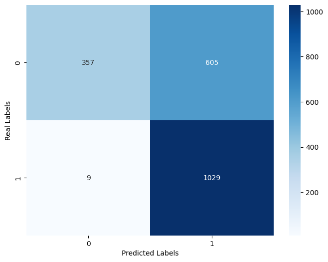

# Fake-News-Detection

Process :
------------
1. Problem Statement
2. Data Gathering - https://www.kaggle.com/datasets/saurabhshahane/fake-news-classification

3. Data Preprocessing: Here we perform some operations on data - NLTK package
    A. Tokenization
    B. Lower Case
    C. Stopwords 
    D. Stemming
    
4. Vectorization (Convert Text data into the Vector):
    A. TF-IDF
    
5. Model Building:
    A. Model Object Initialization
    B. Train and Test the Model
    
6. Model Evaluation:
    A. Accuracy Score
    B. Confusion Matrix
    C. Classification Report

Naive Bayes - False positives and False negatives were high in Naive bayes. 

Logistic regression - performed good on both False positives and negatives, nearly 30 percent reduction in False positives and negatives.

Random Forest - performed good on False negatives, the number came down to only 9 such incorrect cases.

Final result using Random Forest :

